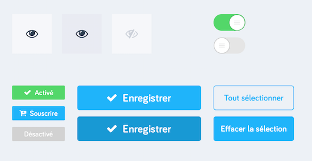
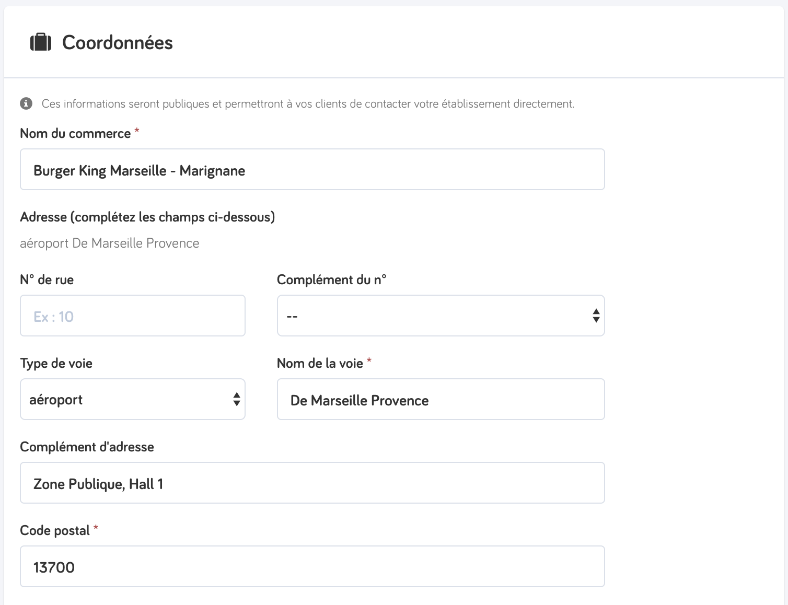

title: Intro to BEM Methodology in CSS
author:
  name: Philip Kubiak
  twitter: koobeeyak
  url: https://github.com/tucobenedicto
output: basic.html
controls: true

--

# BEM: The Methodology™️
## A first look 👀 into Block Element Modifiers in CSS
## Partoo Dev Dojo ⛩ 
## Dec. 18, 2017

--

CSS Organizational *"Methodologies"*

CSS Styling *"Architectures"*

**...Qu'est-ce que c'est??** 🤔


--
[//]: # (What various CSS methodologies are promising)

* Modularity
* Reusability 
* Structure
* ...
* Faster, cleaner, more reusable CSS!

--
[//]: # (But how I understand, from my own definition)

*Essentially...*

* An style of organizational thinking, executed with the help of:
  * Naming Coventions
  * File Structure (e.g. stylesheets)

##### → ["Awesome" CSS](https://github.com/ikkou/awesome-css#architecture) 😎 CSS methodologies / architecture list repo

--

Très cool! 😄

**...Mais pourquoi on en a besoin?** 🤔

--

*~~nested classes 🦉🐦~~ that we will never re-use*


```css
	#lab section.lab-business-found-view .login-form-container {
		margin-top: 120px;
		padding-left: 5px;
	}

	#lab section.lab-business-found-view .login-form-container > .login-form-title {
		font-size: 30px;
		font-weight: 700;
	}
	/* do I need a new, deeply nested class for a simple login form subtitle?
	*  have we really never previously written styles for this?
	*  will I ever remember this code in my next application where I need a login form?
	*/
	#lab section.lab-business-found-view .login-form-container > .login-form-subtitle {
		font-size: 14px;
		font-weight: 700;
		color: #949DB0;
		padding-left: 1px;
	}

	#lab section.lab-business-found-view .login-form-container form#login input {
		width: 240px;
		color: black;
		margin: 4px;
		border: 1px solid #DADCE5!important;
	}
```

--
[//]: # (For Partner Connections, I even had to create a whole separate css file because of all the clashes between important files)
*~~`!important;`~~ overriding CSS classes*
```css
	.btn-green, .btn-green:visited, .btn-green:focus {
		color: #fff;
		border: none;
		background-color: #1cb934 !important;
		border-radius: 4px;
	}
	.btn-green:hover {
		background-color: #189d2c !important;
	}
	
	.btn-green:active {
		color: #fff;
		background: #1cb934 !important;
		border-radius: 4px;
	}

```

--


*~~"Spaghetti" CSS code~~ w/ the help of modularity*


# 🚫🍝

--
[//]: # (Bootstrap already does the work of helping us write CSS code that's clean, reusable, fast)

#  ❤️  

--
[//]: # (This modal, grid system, + other for free)
```jsx
import React from 'react';
import { Modal } from 'react-bootstrap';

const ModalComponent = (props) => {
	<Modal show={props.isModalOpen} onHide={props.closeModal} className="my-modal">
		<Modal.Header>
			<span>My Modal!</span>
		</Modal.Header>
		<Modal.Body>
			<div>
				<span>Lorem Ipsum!</span>
				<button>Click me for stuff!</button>
			</div>
		</Modal.Body>
	</Modal>
}
```

--

## + Partoo UI Kit
# 

--
### *B* . e . m .
#### is Blocks.

```
header, 
container, 
menu, 
checkbox, 
input
```

--

### b . *E* . m .
#### is Elements.

```
menu item, 
list item, 
checkbox caption, 
header title
```

--

### b . e . *M* .
#### is Modifiers.

```
disabled, 
highlighted, 
checked, 
fixed, 
size big, 
color yellow
```

--
[//]: # (Again, a CSS methodology is really just a style guide, so the naming practice is the actual implementation and is very important.)
[//]: # (Separate words using dashes)
### Naming Convention

`.block {}`

→

`.block-name {}`

`.signup-form {}`

`.actions-menu {}`

--
[//]: # (Notice that we are explicitly writing out "button")
### Naming Convention

`.block__elem {}`

→


`.block__elem-name {}`

`.signup-form__name-field {}`

`.actions-menu__confirm-button {}`

--
### Naming Convention

`.block__elem--modifier {}`

→


`.block__elem--modifier-name {}`

`.signup-form__name-field--error {}`

`.actions-menu__confirm-button--disabled {}`

--
[//]: # (Sometimes you might skip element to apply a modifier on the block level)
### Naming Convention

`.block--modifier {}`

→

`.purchase-form--popout {}`

`.signup-bar--simple {}`
--

`.title_bar {}`


`.title_bar img.user_prof_pic  {}`

→


`.title_bar {}`

`.title_bar__user_prof_pic--size-thumbnail {}`

--

### Let's try it on Partoo interface!

--



--


--

### BEM-ification 

#### of Partoo's CSS code base 💥
